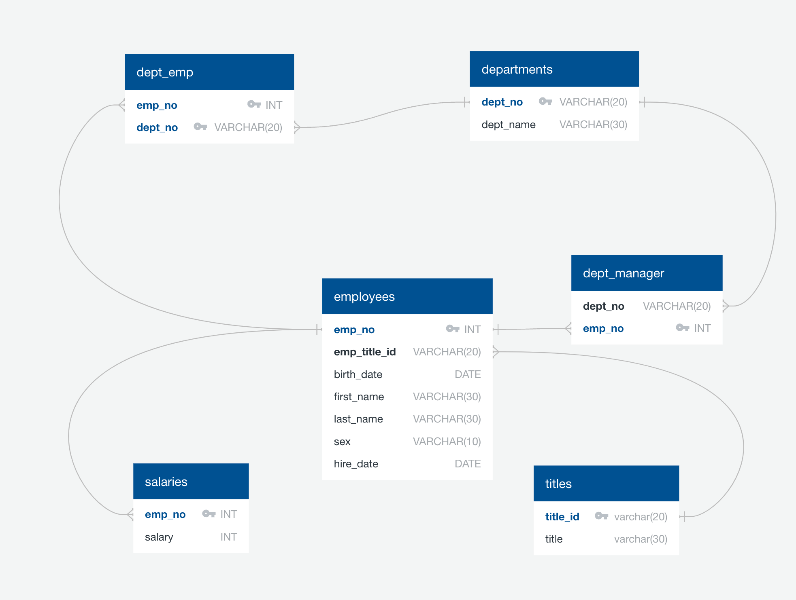

# sql-challenge
## UNC Data Analytics Bootcamp SQL Project

In the context of my role as a data engineer at Pewlett Hackard, I have been tasked with a research project focused on historical employee data from the 1980s and 1990s. The project involves three main phases: data modeling, data engineering, and data analysis.

### Data Modeling:
I started by inspecting the provided CSV files and creating an Entity Relationship Diagram (ERD) to outline the structure of the tables. This ERD captures the relationships between the various entities, helping you plan the database schema.

### Data Engineering:
In this phase, I translated my ERD into actual SQL table schemas. Each of the six CSV files corresponds to a table in the database. I defined the data types for each column, set primary keys, established foreign key relationships where necessary, and ensured data integrity by using NOT NULL constraints and appropriate data lengths. I then proceed to import the data from the CSV files into their respective SQL tables.

### Data Analysis:
After successfully importing the data, I moved on to conducting various data analysis tasks using SQL queries:

1. list the employee number, last name, first name, sex, and salary of each employee.
2. list the first name, last name, and hire date of employees hired in the year 1986.
3. list department managers along with their department number, department name, employee number, last name, and first name.
4. associate each employee with their department number, employee number, last name, first name, and department name.
5. identify employees with the first name "Hercules" and last names beginning with "B," listing their first name, last name, and sex.
6. list of employees in the Sales department, including employee number, last name, and first name.
7. list of employees in both the Sales and Development departments, including employee number, last name, first name, and department name.
8. frequency count of employee last names, listing the number of employees who share each last name in descending order.

### Source code
- To draw the ERD diagram <https://app.quickdatabasediagrams.com/#/>
- How to Query Date and Time in SQL Server <https://popsql.com/learn-sql/sql-server/how-to-query-date-and-time-in-sql-server>
- SQL Query to Find the Name of a Person Whose Name Starts with Specific Letter <https://www.geeksforgeeks.org/sql-query-to-find-the-name-of-a-person-whose-name-starts-with-specific-letter/>
- ALTER TABLE to add a composite primary key <https://stackoverflow.com/questions/8859353/alter-table-to-add-a-composite-primary-key>

### References
Data generated by [Mockaroo(2022)](https://mockaroo.com/) Realistic Data Generator.

